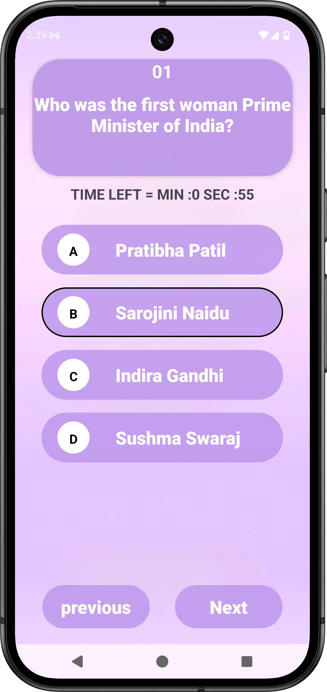

# 🧠 MindWar - Android Quiz App

MindWar is a fun and engaging Android quiz application built using **Java**. It features a simple and clean UI, multiple questions, and interactive options to challenge your general knowledge.

---

## ✨ Features

- 📋 Multiple choice questions
- 🧠 Score tracking
- 🎮 Simple, clean, and responsive UI
- 📱 Built entirely with Java and XML
---

## 🛠️ Built With

- Java
- Android Studio
- Xml
- ConstraintLayout
- LinearLayout (Button)

---

## 🚀 Getting Started

1. Clone the repository:
   ```bash
   git clone https://github.com/madhavgadge01/MindWar.git
---
  ## 👨‍💻 Author
  -[Madhav Gadge](https://github.com/madhavgadge)
  -[Linkdin](https://www.linkedin.com/in/madhav-gadge-610177343?utm_source=share&utm_campaign=share_via&utm_content=profile&utm_medium=android_app)

  ---

## 📸 Screenshots

Front Screen            |        Quiz Screen       |                Result Screen             |
------------------------|--------------------------|------------------------------------------|
|  |  |

